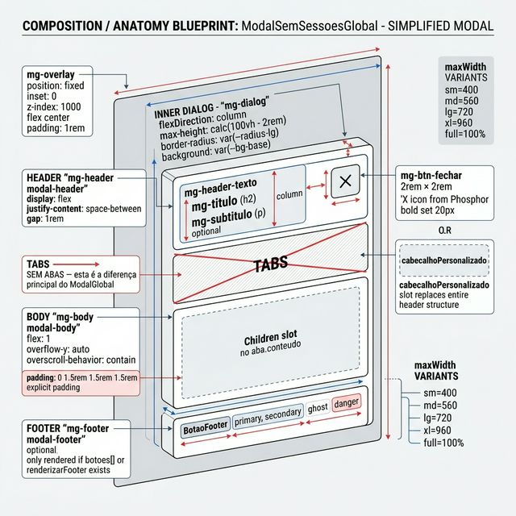
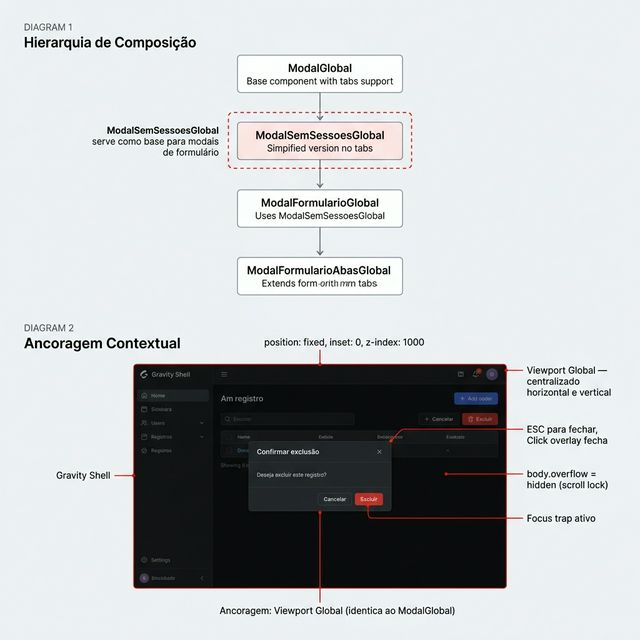

# Documentação Visual — ModalSemSessoesGlobal

Variante simplificada do `ModalGlobal` — **sem suporte a abas/sessões**. Estrutura: Header → Body → Footer. Ideal para confirmações, alertas e formulários simples. Serve como base para `ModalFormularioGlobal`.

## 1. Folha de Especificação Técnica de UX
Configurações do componente: básico (título + body + footer), com footer customizado, com cabecalho personalizado e mobile bottom-sheet.


---

## 2. Especificação de Composição
Anatomia técnica: overlay fixed → dialog flex-column com **3 zonas apenas** (header → body → footer). Sem slot de abas — esta é a diferença principal do `ModalGlobal`.



---

## 3. Composição de Ancoragem Global
Ancoragem viewport global (idêntica ao `ModalGlobal`). Serve como base de composição para `ModalFormularioGlobal`.



| Regra de Ancoragem | Referência Técnica |
| :--- | :--- |
| **Referência Vertical (Y)** | Centralizado verticalmente no viewport (`align-items: center`). |
| **Referência Horizontal (X)** | Centralizado horizontalmente (`justify-content: center`). |
| **Overlay** | `position: fixed`, `inset: 0`, `z-index: 1000`, `backdrop-filter: blur(4px)`. |
| **Max Height** | `calc(100vh - 2rem)` — garante margem mínima de `1rem`. |
| **Mobile (≤640px)** | Bottom-sheet: `align-items: flex-end`, border-radius só no topo, max-height `92vh`. |

---

## Anatomia do Componente

| Propriedade | Valor / Descrição |
| :--- | :--- |
| **Overlay** | `.mg-overlay` — `position: fixed`, `inset: 0`, `z-index: 1000`, `rgba(0,0,0,0.65)`, `backdrop-filter: blur(4px)` |
| **Dialog** | `.mg-dialog` — `flexDirection: column`, `background: var(--bg-base)`, `border-radius: var(--radius-lg)` |
| **Tamanhos** | `sm: 400px` · `md: 560px` (padrão) · `lg: 720px` · `xl: 960px` · `full: 100%` |
| **Altura** | Dinâmica (fit-content) por padrão; fixa via prop `altura` |
| **Header** | `.mg-header` — título `h2` + subtítulo opcional + botão X (`2rem × 2rem`) |
| **Cabecalho Custom** | `cabecalhoPersonalizado` substitui o header inteiro |
| **Body** | `.mg-body` — `flex: 1`, `overflow-y: auto`, `padding: 0 1.5rem 1.5rem 1.5rem` |
| **Footer** | `.mg-footer` — array de `botoes` (primary/secondary/ghost/danger) ou `renderizarFooter()` |
| **⛔ Sem Abas** | **Não possui** `abas`, `tipoAbas`, `abaAtivaInicial` — esta é a diferença do `ModalGlobal` |
| **Fechar** | ESC (desativável), click overlay (desativável), botão X (ocultável via `semFechar`) |
| **Scroll Lock** | `body.style.overflow = 'hidden'` |
| **Focus Trap** | Foco automático no primeiro elemento focável |
| **Acessibilidade** | `role="dialog"`, `aria-modal="true"`, `aria-labelledby` |

---

## Diferença vs ModalGlobal

| Recurso | ModalGlobal | ModalSemSessoesGlobal |
| :--- | :---: | :---: |
| Header (título + subtítulo) | ✅ | ✅ |
| Body (children) | ✅ | ✅ |
| Footer (botões) | ✅ | ✅ |
| Abas (underline/pill) | ✅ | ❌ |
| `abaAtivaInicial` | ✅ | ❌ |
| `tipoAbas` | ✅ | ❌ |
| Body padding explícito | ❌ | ✅ (`0 1.5rem 1.5rem`) |
| Modal Manager / Stack | ✅ | ✅ |

---

## Hierarquia de Composição

```
ModalGlobal (base completa, com abas)
└── ModalSemSessoesGlobal (simplificado, sem abas)  ← ESTE
    └── ModalFormularioGlobal (formulário com campos + BotoesSalvar)
        └── ModalFormularioAbasGlobal (formulário com abas internas)
```

---

## Exemplo de Uso (Código)

```tsx
import { ModalSemSessoesGlobal, useModalLocal } from '@nucleo/modal-sem-sessoes-global'

const { aberto, abrir, fechar } = useModalLocal()

<button onClick={abrir}>Confirmar Exclusão</button>

<ModalSemSessoesGlobal
  aberto={aberto}
  aoFechar={fechar}
  titulo="Confirmar Exclusão"
  subtitulo="Esta ação não pode ser desfeita."
  tamanho="sm"
  botoes={[
    { rotulo: 'Cancelar', variante: 'ghost', ao_clicar: fechar },
    { rotulo: 'Excluir', variante: 'danger', ao_clicar: handleExcluir, carregando: excluindo },
  ]}
>
  <p>Deseja realmente excluir o registro selecionado?</p>
</ModalSemSessoesGlobal>
```
