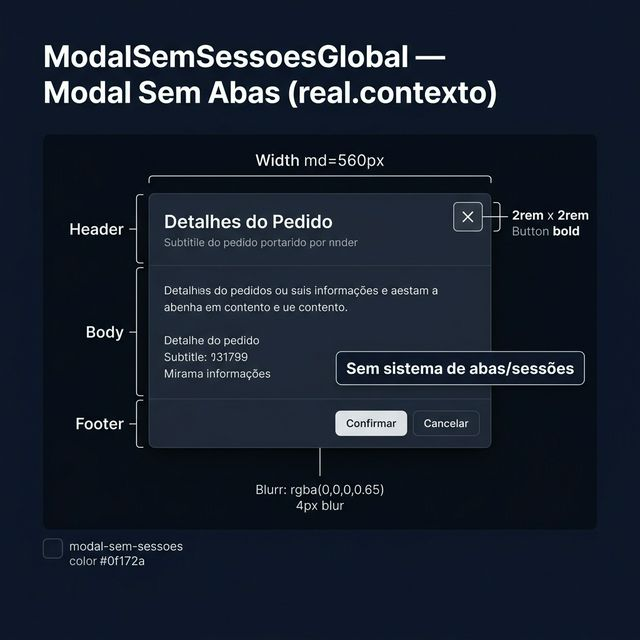
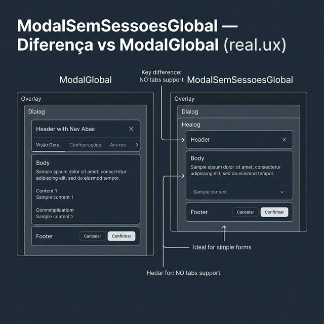
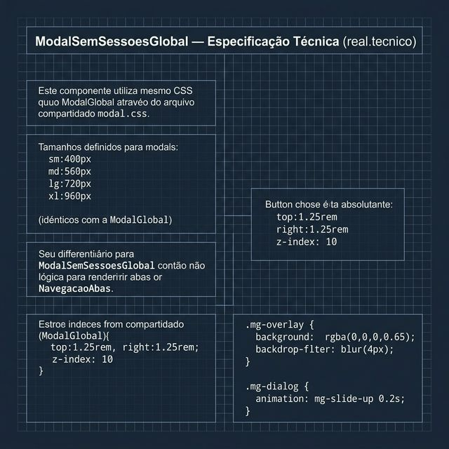

# Documentação Visual — ModalSemSessoesGlobal

Referência visual baseada 100% no código `modal-overlay.tsx` + `modal.css` do pacote `modal-sem-sessoes-global`.

---

## 1. Modal Sem Abas (Contexto)

Versão simplificada do `ModalGlobal` — sem sistema de navegação por abas.
- **CSS Compartilhado**: Usa o mesmo `modal.css`, mesmas escalas de tamanho (`sm/md/lg/xl`).
- **Diferencial**: Sem o componente `NavegacaoAbas` — header conecta diretamente ao body.

---

## 2. Diferença vs ModalGlobal (UX)

Arquitetura de uso:
- **ModalGlobal**: Header → Abas → Body → Footer.
- **ModalSemSessoesGlobal**: Header → Body → Footer (mais direto).
- `ModalFormularioGlobal` usa este modal internamente.

---

## 3. Especificação Técnica

Blueprint das medidas (idênticas ao ModalGlobal):
- **Overlay**: `rgba(0,0,0,0.65)`, `backdrop-filter: blur(4px)`.
- **Animação**: `mg-slide-up` — `translateY(12px) → 0` em `0.2s`.
- **Botão Fechar**: `position: absolute`, `top: 1.25rem`, `right: 1.25rem`.

