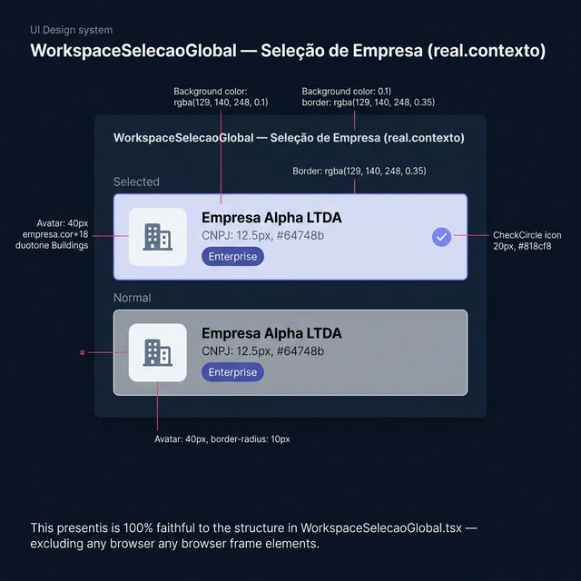
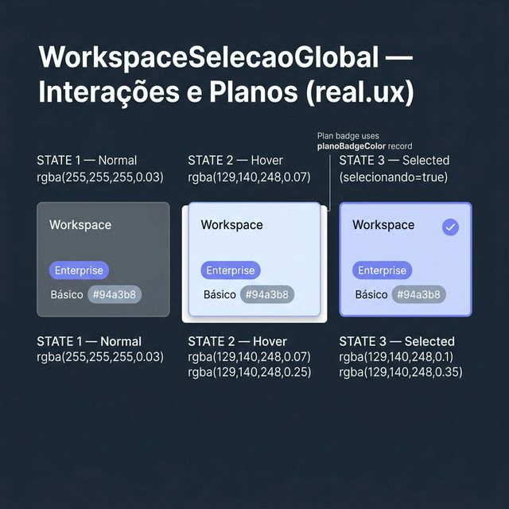
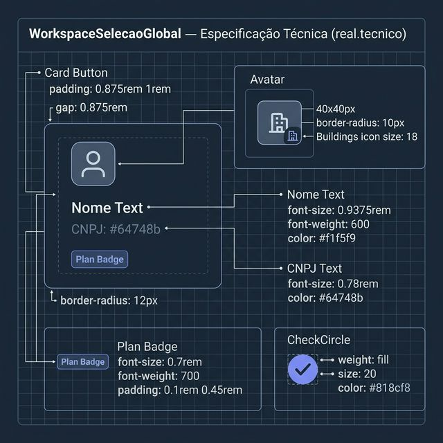

# Documentação Visual — WorkspaceSelecaoGlobal

Referência visual baseada 100% no código `WorkspaceSelecaoGlobal.tsx`.

---

## 1. Seleção de Empresa (Contexto)

Lista de cards de empresas para seleção de workspace ativo.
- **Estado Selecionado**: Fundo Indigo `rgba(129,140,248,0.1)`, borda `rgba(129,140,248,0.35)`.
- **CheckCircle**: Ícone fill de 20px em Indigo `#818cf8` confirmando a seleção.

---

## 2. Interações e Planos (UX)

Comportamento real dos 3 estados do card:
- **Normal**: Fundo quase transparente `rgba(255,255,255,0.03)`.
- **Hover**: Fundo `rgba(129,140,248,0.07)`, borda `rgba(129,140,248,0.25)`.
- **Selecionado**: Fundo Indigo + CheckCircle.
- **Badge de Plano**: Enterprise (Indigo) vs Básico (Muted).

---

## 3. Especificação Técnica

Blueprint das medidas:
- **Card**: `padding: 0.875rem 1rem`, `gap: 0.875rem`, `border-radius: 12px`.
- **Avatar**: `40×40px`, `border-radius: 10px`, cor `empresa.cor` com 18% alpha.
- **Nome**: `0.9375rem` bold / **CNPJ**: `0.78rem` em `#64748b`.
- **Badge Plano**: `0.7rem`, `font-weight: 700`, `padding: 0.1rem 0.45rem`.

