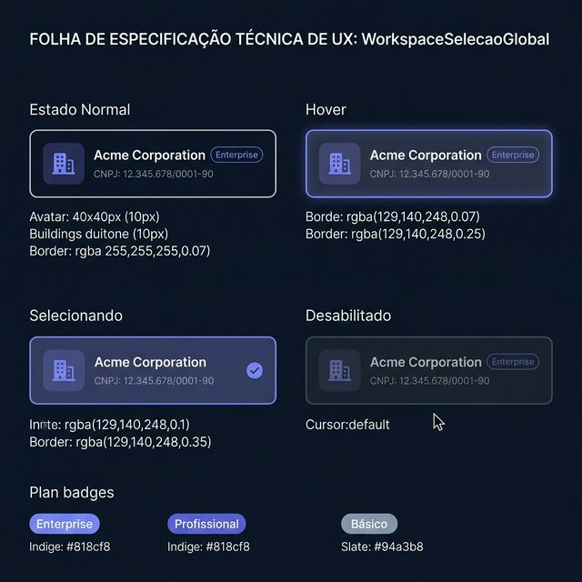
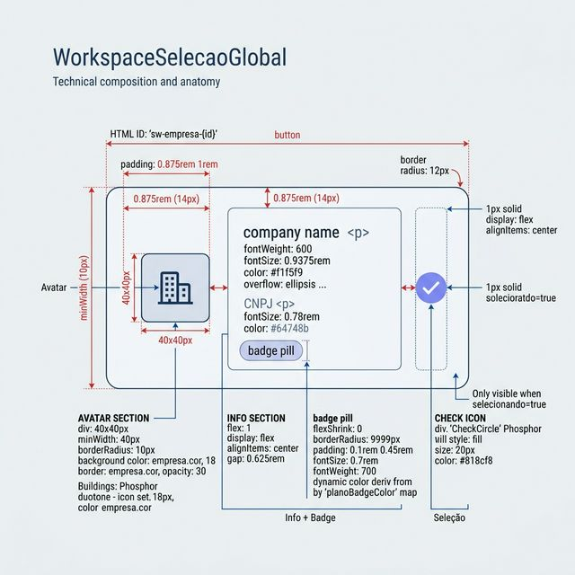
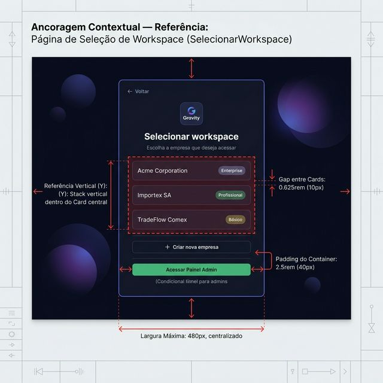

# Documentação Visual — WorkspaceSelecaoGlobal (Modal Workspace Inicial)

Modal/página de seleção inicial de workspace com cards de empresa, avatar dinâmico, badge de plano e estado de seleção animado.

## 1. Folha de Especificação Técnica de UX
Estados do componente: normal, hover (destaque indigo), selecionando (CheckCircle) e desabilitado.



---

## 2. Especificação de Composição
Anatomia técnica: botão flexbox horizontal com avatar (40×40), bloco de informações (nome + CNPJ + badge de plano) e ícone de seleção condicional.



---

## 3. Composição de Ancoragem Global
Posicionamento dentro da página `SelecionarWorkspace`, empilhado verticalmente no card central de seleção.



| Regra de Ancoragem | Referência Técnica |
| :--- | :--- |
| **Referência Vertical (Y)** | Stack vertical (`flexDirection: column`) dentro do card central da página. |
| **Referência Horizontal (X)** | Largura **100%** do card pai (`maxWidth: 480px`). |
| **Gap entre Cards** | **0.625rem** (10px) de espaçamento vertical entre instâncias. |
| **Padding do Container** | Card pai com **2.5rem** (40px) de padding interno. |

---

## Anatomia do Componente

| Propriedade | Valor / Descrição |
| :--- | :--- |
| **Elemento Base** | `<button>` com `id="sw-empresa-{id}"` |
| **Borda Raio** | `12px` |
| **Padding** | `0.875rem 1rem` |
| **Gap Interno** | `0.875rem` (14px) entre avatar, info e check |
| **Avatar** | Div 40×40px, `borderRadius: 10px`, fundo `empresa.cor + "18"`, borda `empresa.cor + "30"` |
| **Ícone Avatar** | `Buildings` (Phosphor, duotone, 18px) na cor `empresa.cor` |
| **Nome da Empresa** | `fontWeight: 600`, `fontSize: 0.9375rem`, cor `#f1f5f9`, truncamento com `text-overflow: ellipsis` |
| **CNPJ** | `fontSize: 0.78rem`, cor `#64748b` |
| **Badge de Plano** | Pill com `borderRadius: 9999px`, `fontSize: 0.7rem`, `fontWeight: 700`, cor dinâmica via `planoBadgeColor` |
| **Cores dos Planos** | Enterprise: `#818cf8` · Profissional: `#818cf8` · Básico: `#94a3b8` |
| **Hover** | Fundo `rgba(129,140,248,0.07)`, borda `rgba(129,140,248,0.25)` |
| **Selecionando** | Fundo `rgba(129,140,248,0.1)`, borda `rgba(129,140,248,0.35)`, exibe `CheckCircle` (fill, 20px, `#818cf8`) |
| **Transição** | `all 0.15s` |
| **Estilização** | Inline styles (sem CSS externo) |

---

## Exemplo de Uso (Código)

```tsx
import { WorkspaceSelecaoGlobal, type Empresa } from '@nucleo/modal-workspace-inicial-global'
import { useState } from 'react'

const empresas: Empresa[] = [
  { id: 'e1', nome: 'Acme Corporation', cnpj: '12.345.678/0001-90', plano: 'Enterprise', cor: '#818cf8' },
  { id: 'e2', nome: 'Importex SA',      cnpj: '96.765.432/0001-10', plano: 'Profissional', cor: '#818cf8' },
  { id: 'e3', nome: 'TradeFlow Comex',  cnpj: '55.123.000/0001-44', plano: 'Básico', cor: '#34d399' },
]

const [selecionando, setSelecionando] = useState<string | null>(null)

<div style={{ display: 'flex', flexDirection: 'column', gap: '0.625rem' }}>
  {empresas.map(emp => (
    <WorkspaceSelecaoGlobal
      key={emp.id}
      empresa={emp}
      selecionando={selecionando === emp.id}
      onClick={() => setSelecionando(emp.id)}
      disabled={selecionando !== null}
    />
  ))}
</div>
```
