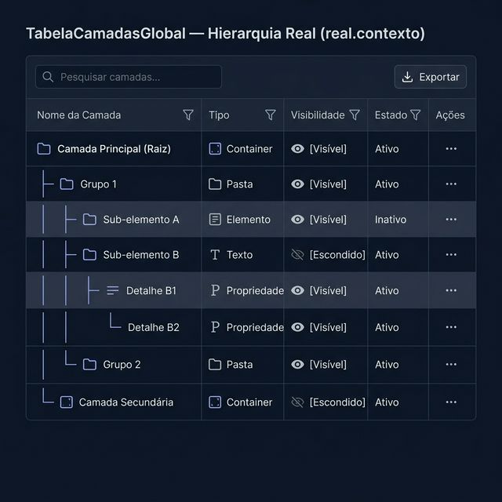
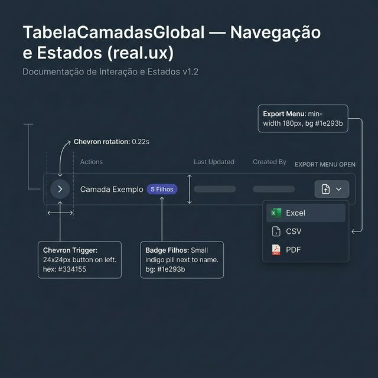
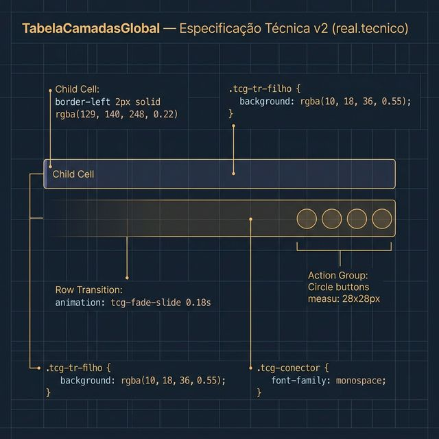

# Documentação Visual — TabelaCamadasGlobal (v2)

Referência visual baseada 100% no código `TabelaCamadasGlobal.tsx` + `tabela-camadas.css`.

---

## 1. Hierarquia Real (Contexto)

Estrutura de árvore para gestão de dados aninhados.
- **Layout**: Toolbar limpa seguindo o padrão da TabelaGlobal.
- **Camadas**: Identação visual com conectores monospace e fundo `rgba(10, 18, 36, 0.55)` para linhas filhas.

---

## 2. Navegação e Estados (UX)

Interações de árvore e menus:
- **Chevron**: Rotação suave de 90 graus no estado aberto.
- **Exportar**: Dropdown de exportação com opções Excel/CSV/PDF listadas verticalmente.
- **Padrão**: Botões de ação em círculo (50% radius) de 28px.

---

## 3. Especificação Técnica

Blueprint da hierarquia:
- **Conectores**: `├──` e `└──` em fonte monospace.
- **Borda Esquerda**: `border-left: 2px solid rgba(129, 140, 248, 0.22)` nas células filhas.
- **Animação**: Entrada das linhas filhas via `tcg-fade-slide` (0.18s).

