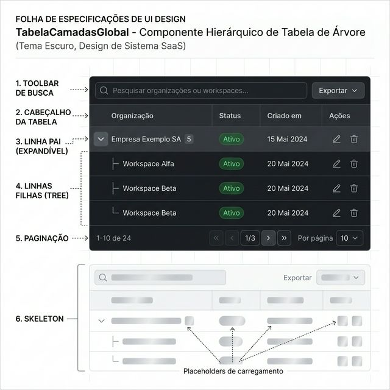
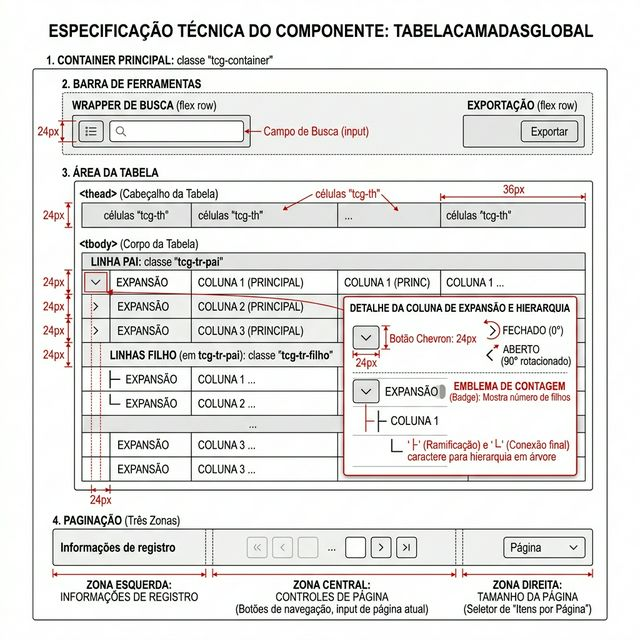
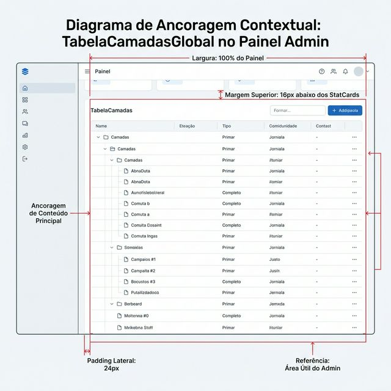

# Documentação Visual — TabelaCamadasGlobal

Tabela hierárquica (Tree Table) com linhas pai/filho expansíveis do Gravity Design System.

## 1. Folha de Especificação Técnica de UX
Layout completo: toolbar com busca e exportação, linhas pai expansíveis, linhas filhas com conectores de árvore, paginação e skeleton.



---

## 2. Especificação de Composição
Anatomia técnica: container, toolbar bilateral, thead/tbody compartilhado, chevron de expansão, conectores de hierarquia e paginação tri-zona.



---

## 3. Composição de Ancoragem Global
Posicionamento na área de conteúdo principal do painel administrativo.



| Regra de Ancoragem | Referência Técnica |
| :--- | :--- |
| **Referência Vertical (Y)** | **16px** abaixo dos StatCards ou do cabeçalho de seção. |
| **Referência Horizontal (X)** | Largura **100%** da área útil do painel. |
| **Padding Lateral** | **24px** (p-6) do container pai. |
| **Contexto** | Área de conteúdo principal do Admin ou Workspace. |

---

## Anatomia do Componente

| Área | Medida / Valor |
| :--- | :--- |
| **Container** | Classe `tcg-container` |
| **Toolbar** | Busca à esquerda (`tcg-busca-wrapper`) + Exportar à direita (`tcg-export-wrapper`) |
| **Chevron** | Botão 24px, ícone SVG 12×12, rotação 90° quando aberto |
| **Badge de Filhos** | Contador circular ao lado da primeira coluna pai |
| **Conectores** | Caracteres `├` e `└` para indicar hierarquia visual |
| **Linha Pai** | Classe `tcg-tr-pai`, clicável para expandir |
| **Linha Filha** | Classe `tcg-tr-filho`, animação com delay progressivo (`fi * 20ms`) |
| **Paginação** | Tri-zona: info (esquerda) + controles «‹ 1/N ›» (centro) + "Por página" (direita) |
| **Skeleton** | 6 linhas com shimmer animado durante carregamento |

---

## Exemplo de Uso (Código)

```tsx
import { TabelaCamadasGlobal } from '@nucleo/tabela-camadas-global'
import type { TCGColuna } from '@nucleo/tabela-camadas-global'

const colunasPai: TCGColuna<Org>[] = [
  { key: 'nome', label: 'Organização' },
  { key: 'status', label: 'Status', render: (v) => <Badge>{v}</Badge> },
  { key: 'criadoEm', label: 'Criado em' },
]

const colunasFilhas: TCGColuna<Workspace>[] = [
  { key: 'nome', label: 'Workspace' },
  { key: 'usuarios', label: 'Usuários', align: 'center' },
  { key: 'status', label: 'Status' },
]

<TabelaCamadasGlobal
  dados={organizacoes}
  colunas={colunasPai}
  colunasFilhas={colunasFilhas}
  filhos={(org) => org.workspaces}
  acoes={[{ id: 'edit', icone: <Pencil />, onClick: handleEdit }]}
  acoesFilhas={[{ id: 'view', icone: <Eye />, onClick: handleView }]}
  placeholderBusca="Buscar organização..."
  itensPorPagina={10}
/>
```
