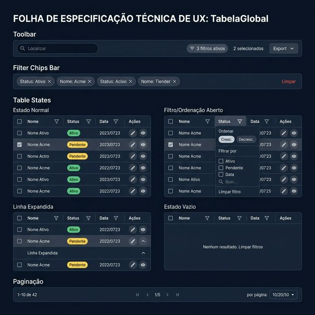
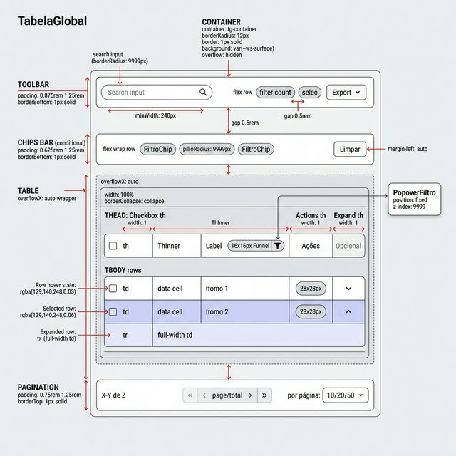
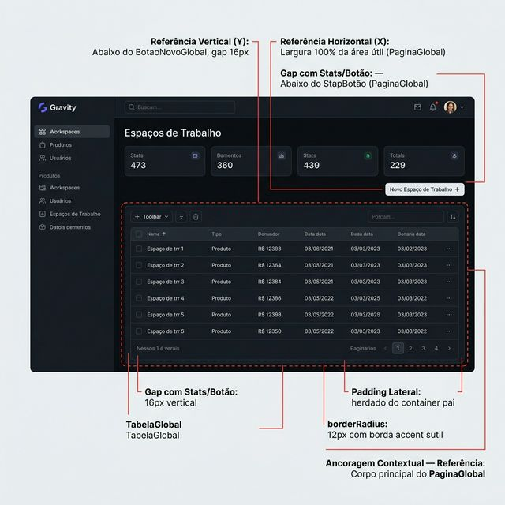

# Documentação Visual — TabelaGlobal

Tabela de dados completa com busca global, filtros por coluna (texto/número/período), ordenação, seleção com checkboxes, linhas expandíveis, ações por linha, exportação e paginação.

## 1. Folha de Especificação Técnica de UX
Features do componente: toolbar com busca e badges, barra de chips de filtros, popover de filtro/ordenação por coluna, linha expandida, estado vazio e paginação.



---

## 2. Especificação de Composição
Anatomia técnica: container com 4 zonas — toolbar → chips bar (condicional) → tabela scrollável (thead + tbody com ações e expansão) → footer de paginação.



---

## 3. Composição de Ancoragem Global
Posicionamento no corpo principal da `PaginaGlobal`, abaixo dos Stats Cards e do `BotaoNovoGlobal`.



| Regra de Ancoragem | Referência Técnica |
| :--- | :--- |
| **Referência Vertical (Y)** | Abaixo do `BotaoNovoGlobal`, gap **16px** vertical. |
| **Referência Horizontal (X)** | Largura **100%** da área útil do `PaginaGlobal`. |
| **Gap com Stats/Botão** | **16px** de distância vertical do topo da tabela. |
| **Container** | `borderRadius: 12px`, `border: 1px solid var(--ws-accent-border)`, `overflow: hidden`. |

---

## Anatomia do Componente

### Container (`tg-container`)

| Propriedade | Valor / Descrição |
| :--- | :--- |
| **Background** | `var(--ws-surface, #1e293b)` |
| **Borda** | `1px solid var(--ws-accent-border)` |
| **Border Radius** | `12px` |
| **Font Family** | `var(--font, Plus Jakarta Sans)` |

### Toolbar (topo)

| Propriedade | Valor / Descrição |
| :--- | :--- |
| **Padding** | `0.875rem 1.25rem` |
| **Busca** | Input pill (`borderRadius: 9999px`), `minWidth: 240px`, ícone `MagnifyingGlass` (14px, bold) |
| **Badge Filtros** | Pill com contagem de filtros ativos, fundo `rgba(199,210,254,0.1)` |
| **Badge Seleção** | Pill com contagem de selecionados |
| **Exportação** | Dropdown botão `Exportar` + menu de ações (`TabelaExportAcao[]`) |

### Chips de Filtros (condicional)

| Propriedade | Valor / Descrição |
| :--- | :--- |
| **Padding** | `0.625rem 1.25rem` |
| **Chips** | Pills `borderRadius: 9999px`, fundo `rgba(199,210,254,0.1)`, botão ✕ para remover |
| **Limpar Tudo** | Botão com borda vermelha sutil, hover vermelho |

### Cabeçalho da Tabela (`thead`)

| Propriedade | Valor / Descrição |
| :--- | :--- |
| **Th Padding** | `0.75rem 1rem` |
| **Fonte** | `0.6875rem`, `fontWeight: 700`, `uppercase`, `letterSpacing: 0.07em` |
| **Cor** | `#64748b` |
| **Background** | `rgba(129,140,248,0.04)` |
| **Filtro Ícone** | `Funnel` (Phosphor), 10px, botão 16×16px com borda condici |
| **Checkbox** | `accentColor: #818cf8`, 14×14px |

### PopoverFiltro (portal)

| Propriedade | Valor / Descrição |
| :--- | :--- |
| **Posição** | `position: fixed`, `z-index: 9999`, via `ReactDOM.createPortal` |
| **Largura** | `minWidth: 220px`, `maxWidth: 280px` |
| **Seções** | Ordenar (Cresc./Decresc. pills) → Filtrar por (texto: checkboxes, número: min/max, período: calendário) → Limpar |
| **Background** | `var(--ws-surface, #1e293b)`, `borderRadius: 10px` |

### Corpo da Tabela (`tbody`)

| Propriedade | Valor / Descrição |
| :--- | :--- |
| **Td Padding** | `0.875rem 1rem` |
| **Hover** | `rgba(129,140,248,0.03)` |
| **Selecionada** | `rgba(129,140,248,0.06)` |
| **Ações** | Botões circulares 28×28px com tooltip, hover `rgba(129,140,248,0.12)` |
| **Expansão** | `CaretDown` 14px, rotação 180° quando expandida, conteúdo em tr adicional |
| **Vazio** | Mensagem centralizada com link "Limpar filtros" |

### Paginação (footer)

| Propriedade | Valor / Descrição |
| :--- | :--- |
| **Padding** | `0.75rem 1.25rem` |
| **Contador** | `"X–Y de Z"`, `fontSize: 0.8125rem`, cor `#64748b` |
| **Navegação** | Botões `« ‹ página/total › »` |
| **Por Página** | Select nativo com opções `[10, 20, 50]` |

---

## Tipos de Coluna

| `tipo` | Comportamento |
| :--- | :--- |
| `'texto'` | Filtro por checkboxes (valores distintos), busca local se >5 valores |
| `'numero'` | Filtro por intervalo (min/max), inputs numéricos |
| `'periodo'` | Filtro por intervalo de datas via `CalendarioCampoGlobal` |

---

## Exemplo de Uso (Código)

```tsx
import { TabelaGlobal, type TabelaGlobalColuna, type TabelaGlobalAcao } from '@nucleo/tabela-global'
import { Pencil, Eye, Prohibit } from '@phosphor-icons/react'

const colunas: TabelaGlobalColuna<Workspace>[] = [
  { key: 'nome', label: 'Nome do Espaço', tipo: 'texto', largura: '30%' },
  { key: 'proprietario', label: 'Proprietário', tipo: 'texto' },
  { key: 'criadoEm', label: 'Data de Criação', tipo: 'periodo' },
  { key: 'status', label: 'Status', tipo: 'texto', align: 'center',
    render: (val) => <span className={`badge badge-${val === 'Ativo' ? 'success' : 'warning'}`}>{val}</span> },
]

const acoes: TabelaGlobalAcao<Workspace>[] = [
  { id: 'editar', icone: <Pencil size={14} />, tooltip: 'Editar', onClick: (ws) => abrirEditar(ws) },
  { id: 'ver', icone: <Eye size={14} />, tooltip: 'Visualizar', onClick: (ws) => abrirDetalhe(ws) },
  { id: 'suspender', icone: <Prohibit size={14} />, tooltip: 'Suspender', onClick: (ws) => suspender(ws),
    onRenderStyle: () => ({ background: 'rgba(239,68,68,0.12)', borderColor: 'rgba(239,68,68,0.3)', color: '#f87171' }) },
]

<TabelaGlobal
  dados={workspaces}
  colunas={colunas}
  acoes={acoes}
  renderExpandido={(ws) => <DetalheWorkspace workspace={ws} />}
  acoesExportacao={[
    { label: 'CSV', icone: <DownloadSimple size={14} />, onClick: (dados) => exportarCSV(dados) },
  ]}
/>
```
