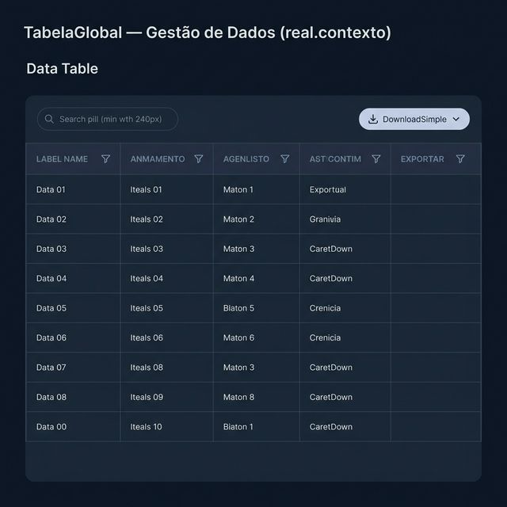
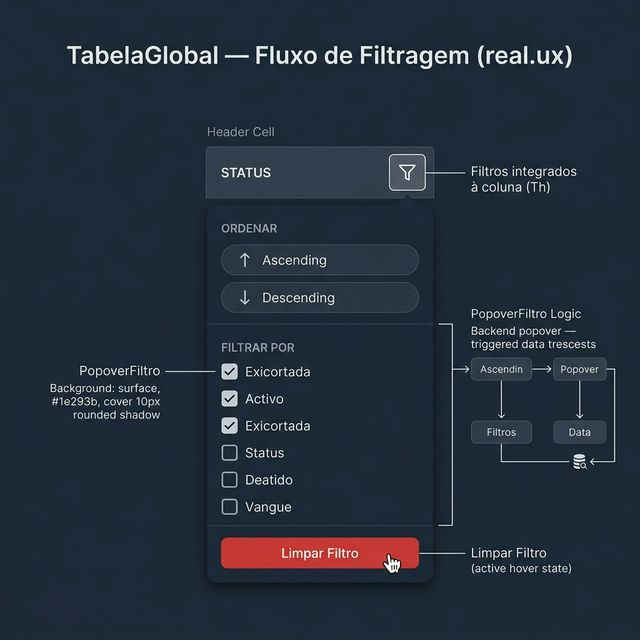
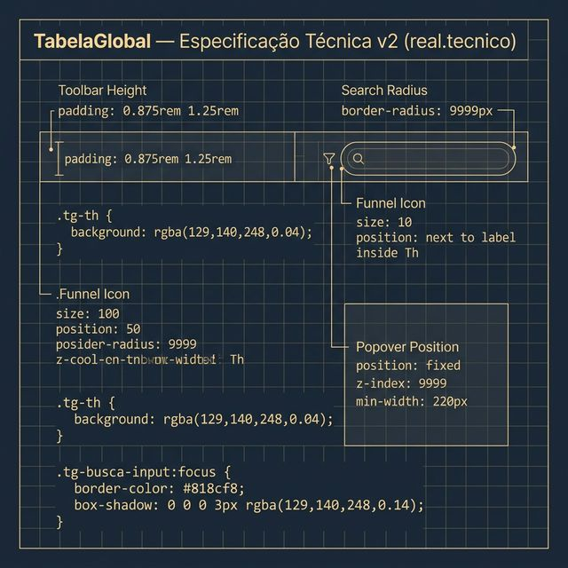

# Documentação Visual — TabelaGlobal (v2)

Referência visual baseada 100% no código `tabela.tsx` + `tabela.css`.

---

## 1. Gestão de Dados (Contexto)

Visão limpa do componente. 
- **Main Toolbar**: Apenas Pesquisa (esquerda) e Exportar (direita). Sem filtros de topo.
- **Filtros por Coluna**: Cada Th possui um ícone de `Funnel` (Funil) para acionar o menu de filtragem.
- **Sticky Header**: Fundo `rgba(129, 140, 248, 0.04)` fixo no topo.

---

## 2. Fluxo de Filtragem (UX)

Demonstração do `PopoverFiltro`:
- **Trigger**: Clique no Funil da coluna.
- **Menu**: Renderizado via `Portal` com seções de Ordenação e Checklist de valores.
- **Fidelidade**: Fundo surface `#1e293b` com bordas Indigo de baixa opacidade.

---

## 3. Especificação Técnica

Blueprint das medidas oficiais:
- **Funnel Icon**: Tamanho `10`, posicionado internamente à direita do label.
- **Popover**: `position: fixed`, `z-index: 9999`, `min-width: 220px`.
- **Search**: `border-radius: 9999px`, `min-width: 240px`.

